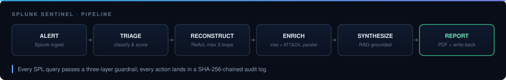

  
  
  
  

I build autonomous agents for domains where a wrong action is expensive — security operations, data governance, and healthcare administration. The through-line across everything below is that **the model is never the last word**: agents propose, deterministic code decides, and an independent read of an external system confirms what actually happened.

I measure that claim instead of asserting it. Every system here ships with an ablation — break the control on purpose, watch the metric collapse — because a guardrail that has never been observed failing is an untested guardrail.

 

## Selected work

### [Splunk Sentinel](https://github.com/Asembris/splunk-sentinel) &nbsp;·&nbsp; Autonomous SOC investigation

Six specialized agents reconstruct an attack kill chain from a Splunk alert in **~100 seconds** — a workflow that costs a human analyst roughly four hours. ReAct-based reconstruction, parallel threat-intel and MITRE ATT&CK enrichment, RAG-grounded synthesis, and write-back into Splunk.

| | |
|:--|:--|
| **Rigor** | 425 passing tests across 242 commits |
| **Economics** | ~$0.009 and ~50K tokens per full investigation |
| **Containment** | Three-layer SPL guardrail — deterministic blocking, index authorization, SHA-256-chained immutable audit log |
| **Knowledge** | 697 MITRE techniques, 50+ CVEs, 15 IR playbooks |

     

**[▶ Demo video](https://youtu.be/vdQYQY1cXFA)** &nbsp;·&nbsp; [Devpost](https://devpost.com/software/splunk-sentinel) &nbsp;·&nbsp; [Repository](https://github.com/Asembris/splunk-sentinel)

<!-- GIF SLOT: 8-12s of an alert arriving and the kill chain assembling. Highest-impact addition to this page. -->

 

### [Attest](https://github.com/Asembris/Attest) &nbsp;·&nbsp; Deterministic groundedness auditing for agents

An auditor for AI agents that make claims about data. Claims are checked against DataHub's catalog by plain code — date math, set membership, string comparison. **Zero verdicts are decided by a model.** Approved verdicts are written back as content-addressed assertions, so the next agent inherits verified facts rather than unchecked assertions.

| | |
|:--|:--|
| **Proof** | 1.00 accuracy across 40 labeled claims; **0.675 when a checker is deliberately sabotaged** |
| **Honesty** | Three-valued verdicts — Supported / Contradicted / **Insufficient-Coverage** — refusing to read silence as disagreement |
| **Enforcement** | Any verdict that spends model tokens is auto-FLAGGED and cannot be approved |
| **Findings** | DataHub's MCP server diverged from GraphQL on 17/17 seeded datasets; upstream issues filed with reproductions, plus a proposed fix (PR #182) |

     

**[▶ Demo video](https://www.youtube.com/watch?v=IgCPzC9oR-w)** &nbsp;·&nbsp; [Evidence dossier](https://asembris.github.io/Attest/) &nbsp;·&nbsp; [Interactive audit replay](https://asembris.github.io/Attest/replay/) &nbsp;·&nbsp; [Repository](https://github.com/Asembris/Attest)

<!-- GIF SLOT: the replay running, ideally landing on a CONTRADICTED verdict. -->

 

### [CareLoop](https://github.com/Asembris/CareLoop) &nbsp;·&nbsp; Autonomous caregiving back-office with hard authority limits

Handles family caregiving paperwork — bookings, documents, follow-ups — under a three-layer authorization model. **Two LLM agents hold no tool access at all.** A deterministic policy engine enforces declarative rules at two independent checkpoints, and every extracted fact carries `{source_doc, page, trust_level}` provenance.

| | |
|:--|:--|
| **Result** | **0 of 320** adversarial attempts produced an unauthorized external action |
| **Control** | Removing the authority layer produced **320 of 320** — the number is load-bearing |
| **Corpus** | 40 attacks across two delivery vectors, including prompt injection through ingested documents |
| **Reproducibility** | Offline evaluation suite runs at zero cost, with no provider credentials |

    

**[▶ Live demo](https://d2heuwvhvrdyig.cloudfront.net)** &nbsp;·&nbsp; [Evidence dossier](https://asembris.github.io/CareLoop/) &nbsp;·&nbsp; [Repository](https://github.com/Asembris/CareLoop)

<!-- GIF SLOT: an injected instruction hitting the policy engine and being refused. Your most persuasive five seconds. -->

 

## How I build

| | |
|:--|:--|
| **Ablate every control** | A guardrail never observed failing is an untested guardrail. |
| **One defensible number** | Derived from real API responses. Never a mock, never an estimate. |
| **Determinism where it counts** | Models are excellent at proposing and terrible at being accountable. Authority stays in code. |
| **Provenance by default** | Facts carry their source, actions carry an audit trail, state changes are append-only. |
| **Plan-gated development** | Written scope and spec before every build phase; conventional commits; CI enforcement of the invariants that matter. |

## Stack

| | |
|:--|:--|
| **Languages** |     |
| **Agents &amp; LLM** |         |
| **Backend &amp; Infra** |       |
| **Data** |       |
| **Observability** |   |

## Currently

Building a governed cross-origin capability layer for the emerging **WebMCP** standard — one browser agent operating across three independent companies' web apps while remaining *structurally* unable to authorize anything.

## Background

AI engineering at **ESPRIT**, Tunisia &nbsp;·&nbsp; Head Trainer, ACM ESPRIT Student Chapter &nbsp;·&nbsp; Teaching assistant and organizer at **MASSAI 2026** (agentic AI, MLOps, AI security)

  
  

